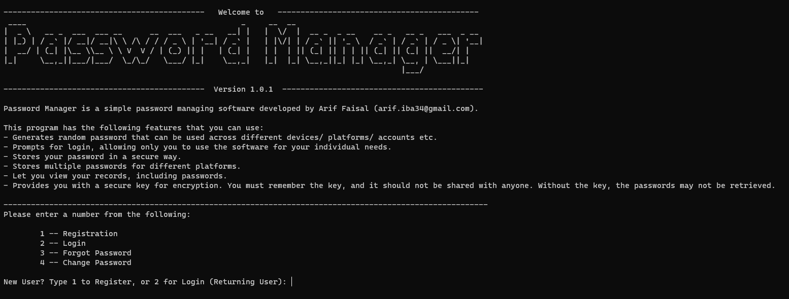

# Password Manager

Password Manager Software is designed to manage all your password needs, from generating random passwords to storing them in a secured encrypted version. The software uses encrytion method to securely store your password, along with other data. It also stores your record in the local database of your computer, making it safe from external threats.  

## Table of contents

- [Overview](#overview)
  - [Functionality](#functionality)
  - [Screenshot](#screenshot)
  - [Installation](#installation)
  - [Links](#links)
- [My process](#my-process)
  - [Built with](#built-with)
  - [Modules used](#modules-used)
  - [Continued development](#continued-development)
- [Author](#author)

## Overview

### Functionality

Users should be able to:

- Register/ Login using their credentials
- Use Change/ Forgot Password feature [in development] 
- Generate a random password
- Store encrypted passwords in the database
- View all records
- Delete records
- Generate a secure and unique key
- View Help/ FAQ section for more details

### Screenshot

### Installation

This program was made with Python 3.11.1. Ensure other dependencies mentioned in requirements.txt are installed in your system. Use "python main.py" in CMD to start the program.

### Links

- Solution URL: [Add solution URL here](https://your-solution-url.com)
- Live Site URL: [Add live site URL here](https://your-live-site-url.com)

## My process

### Built with

Python

### Modules used

- Cryptography
- Art 
- Random Password Generator
- Tabulate
- Pwinput

### Continued development

Forgot Password and Change Password features are the focus of future developments which will be available in the next release.

## Author

- Website - [Arif Faisal](https://arifaisal123.github.io)
- Twitter - [@faisalcodes123](https://twitter.com/faisalcodes123)
